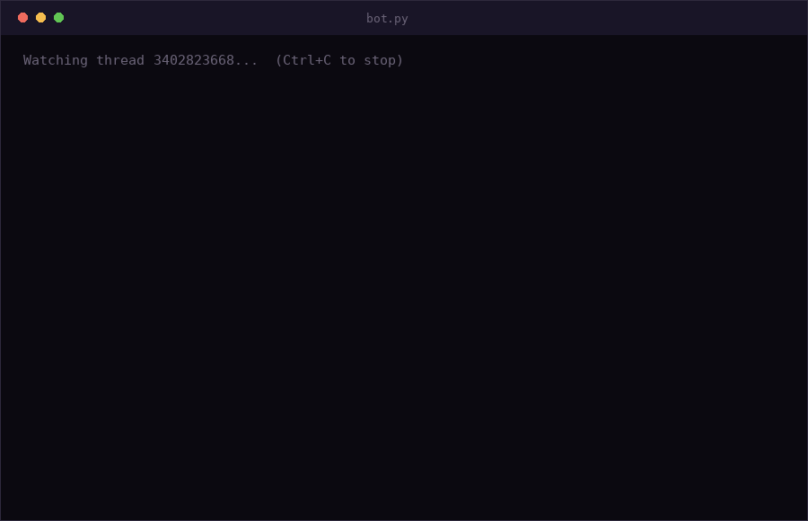

# instagram-claude-bot

[](https://www.python.org/downloads/)
[](LICENSE)
[](https://www.anthropic.com/)

An Instagram group chat bot powered by Claude. Say its name, it replies in
character.



## Why this exists

Wiring a language model to a chat API is a weekend project. Getting one that
does not feel like a chatbot is the harder part, and that is what most of the
code here addresses.

**Models settle into catchphrases.** Once a joke lands, it comes back every
few replies until it is unbearable. A general instruction not to repeat
itself does not hold. This bot scans its own recent replies for phrases
appearing across multiple messages, filters out ordinary English, and names
the survivors explicitly in the next prompt.

**Context is expensive.** Sending the whole transcript on every reply gets
costly fast, but a model with no memory cannot hold a conversation. The
compromise here is a small verbatim window plus a rolling summary that gets
regenerated periodically and replaces its predecessor, so it stays a fixed
size no matter how long the bot runs.

**Names are not people.** A username tells the model nothing. After someone
has sent enough messages, a background call writes a short profile of them
that is refined over time and persisted, so the bot eventually knows who it
is talking to.

**Group chats are not one-to-one.** When several people trigger it at once,
naively answering the first one and ignoring the rest reads as broken. Those
get batched into a single reply that addresses everyone.

## Warning: read this first

- This uses **instagrapi**, an unofficial reverse-engineered Instagram API.
  It is not endorsed by Instagram and automating an account can get it
  restricted or banned. **Use a throwaway account, not your main one.**
- Only run this in group chats where **everyone knows a bot is present**.
  The bot reads all messages in the thread and sends personality profiles of
  participants to an external API. Get consent from your group first.
- Costs real money. Every trigger is an Anthropic API call, plus occasional
  background calls for personas and summaries. Haiku is cheap but not free.

## Setup

**1. Requirements:** Python 3.9+, an Instagram account, and an
[Anthropic API key](https://console.anthropic.com/settings/keys).

**2. Install:**

```bash
git clone https://github.com/YOUR_USERNAME/instagram-claude-bot.git
cd instagram-claude-bot
pip install -r requirements.txt
```

**3. Configure:**

```bash
cp .env.example .env
```

Open `.env` and fill in `IG_USERNAME`, `IG_PASSWORD`, `ANTHROPIC_API_KEY`,
and `THREAD_ID`. Everything else has sensible defaults.

**4. Run:**

```bash
python bot.py
```

The bot only reacts to messages sent *after* it starts, so it will not reply
to a backlog on first launch.

## Finding your THREAD_ID

Every group chat has a numeric ID. To find yours, run this once with your
credentials in `.env`:

```python
from dotenv import load_dotenv
from instagrapi import Client
import os

load_dotenv()
cl = Client()
cl.login(os.getenv("IG_USERNAME"), os.getenv("IG_PASSWORD"))

for t in cl.direct_threads(amount=20):
    if t.is_group:
        print(f"{t.id}  {t.thread_title or [u.username for u in t.users]}")
```

Copy the ID for the chat you want into `.env`. It does not change over the
life of the group, so you only need to do this once.

## Configuration

All settings live in `.env`. The interesting ones:

| Setting | Default | What it does |
|---|---|---|
| `BOT_NAME` | `Computah` | What the bot calls itself |
| `WATCH_WORD` | `computah` | The word that summons it |
| `BOT_PERSONALITY` | dry, blunt... | One line describing its character |
| `POLL_INTERVAL_SECONDS` | `10` | Seconds between checks |
| `RECENT_CONTEXT_MESSAGES` | `10` | Messages seen word-for-word |
| `MAX_HISTORY_TURNS` | `8` | Own past replies remembered |
| `CLAUDE_MODEL` | Haiku | Swap for a bigger model if you want |

To completely reskin the bot, change `BOT_NAME`, `WATCH_WORD`, and
`BOT_PERSONALITY`. No code changes needed.

## How it works

**Polling.** Checks the thread every few seconds for new messages. Not
real-time push, but simple and reliable. Instagram's private API does expose
an MQTT realtime channel if you want to go further.

**Session reuse.** Instagram challenges accounts that appear to log in from
a new device every time. The bot saves its device fingerprint before its
first login attempt and reuses it, which avoids most checkpoint prompts.

**Error handling.** Failures are logged to `data/bot.log` with full
tracebacks while the loop stays alive, and repeated errors back off
exponentially rather than hammering a rate-limited API.

## Troubleshooting

**`ChallengeRequired`.** Instagram wants manual verification. Log into the
account in the official app or on instagram.com, complete the prompt, wait
15-30 minutes, then retry. This cannot be resolved from code.

**`Your version of Instagram is out of date`.** instagrapi is stale.
Run `pip install --upgrade instagrapi`.

**Bot replies to the wrong person, or ignores someone.** Check that
`WATCH_WORD` is not a common substring of ordinary words in your chat.

**Bot seems stuck or silent.** Check `data/bot.log`. Every error is logged
there with a full traceback, even ones that only printed one line to the
terminal.

**Repeated errors.** The bot backs off exponentially rather than hammering
a rate-limited API, so recovery may take a minute. This is intentional.

## Data and privacy

Everything written to `data/` is gitignored. That directory contains your
Instagram session token, learned notes about real people, and saved chat
messages. Do not commit it, and be aware that message content is sent to
Anthropic's API for processing.

To reset the bot's memory, delete `data/personas.json` and
`data/chat_summary.txt`. To force a fresh login, delete `data/session.json`.

## Regenerating the demo

The GIF above is generated, not recorded. `docs/make_demo.py` renders it
frame by frame with Pillow, so you can edit the script to change the
conversation and re-run it:

```bash
python docs/make_demo.py
```

## License

MIT
